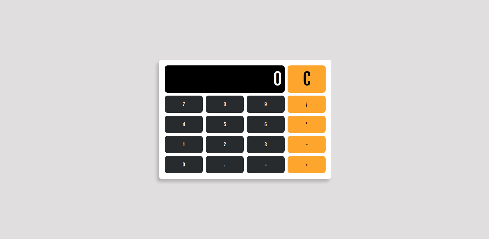

# Calculadora Usando Angular

<figure style="display: grid; place-items: center;">
  
</figure>

## Como baixar ?

```sh
git clone https://github.com/glaucioripol/angular-calc.git
```

## Quero Contribuir, como faço?

- Faça um fork aqui.
- Padrões dos commits
  - de preferência em inglês, mas caso não dê ok.
  - usar o conventional commit <https://www.conventionalcommits.org/en/v1.0.0/>
- Abrir um pull request e olharei com carinho

## bugs Conhecidos

- [ ] não está adicionando floats, se tu tentar digitar `25.5` ele não adiciona o ponto e fica `255`.

## melhorias

- [ ] deixar responsivo.
- [ ] qualquer melhora visual é bem vinda.
- [ ] adição de novas features.
